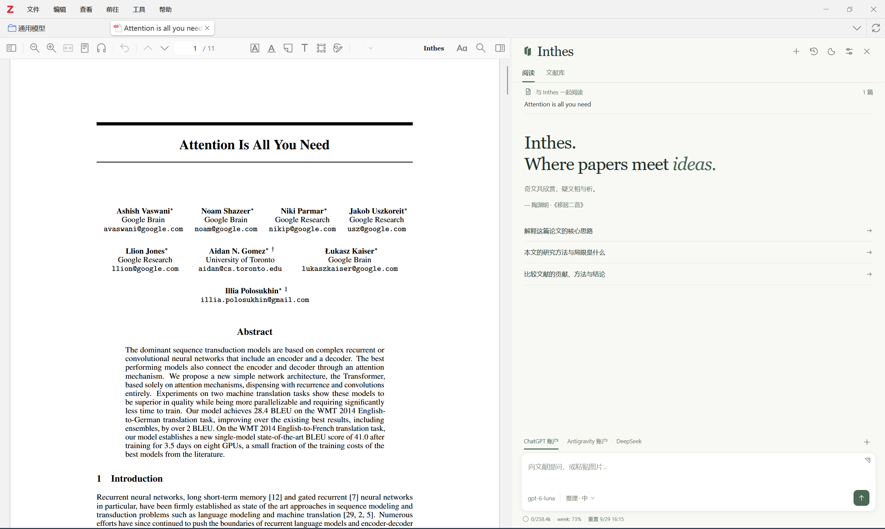
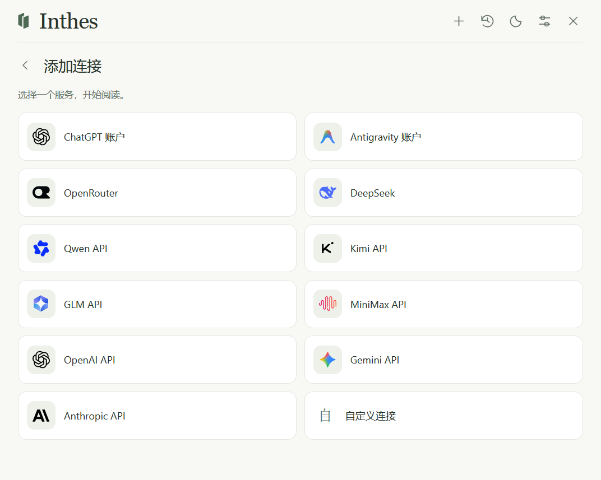
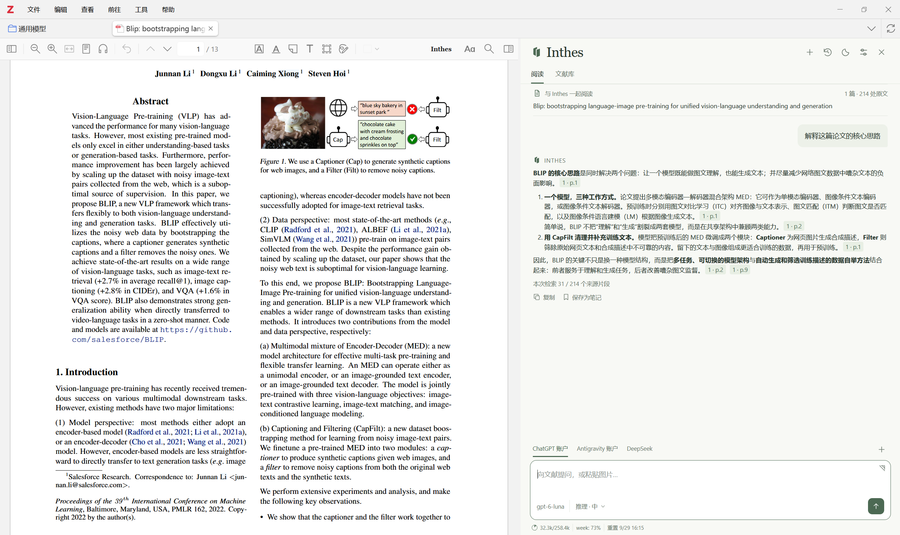
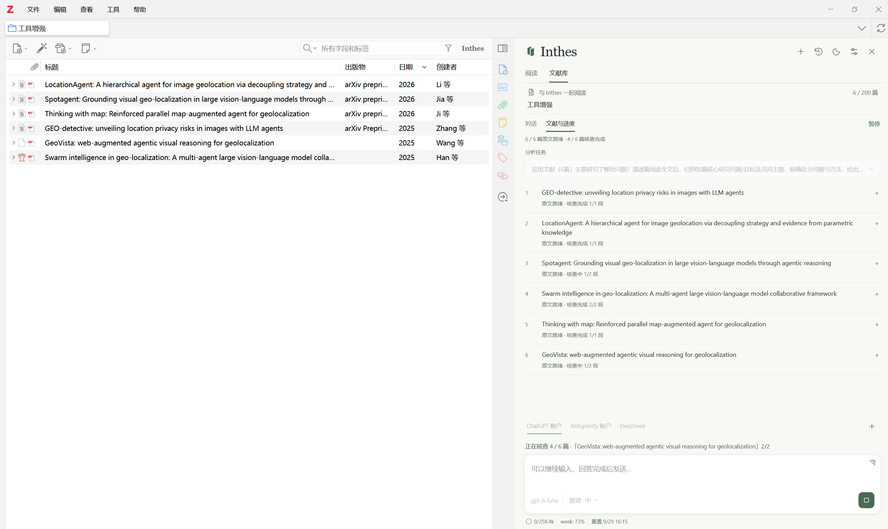
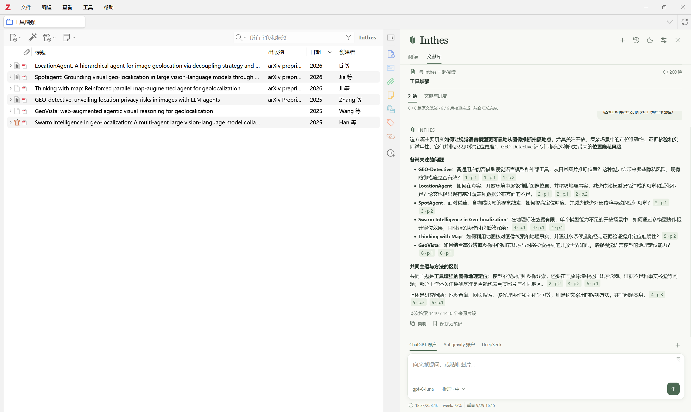
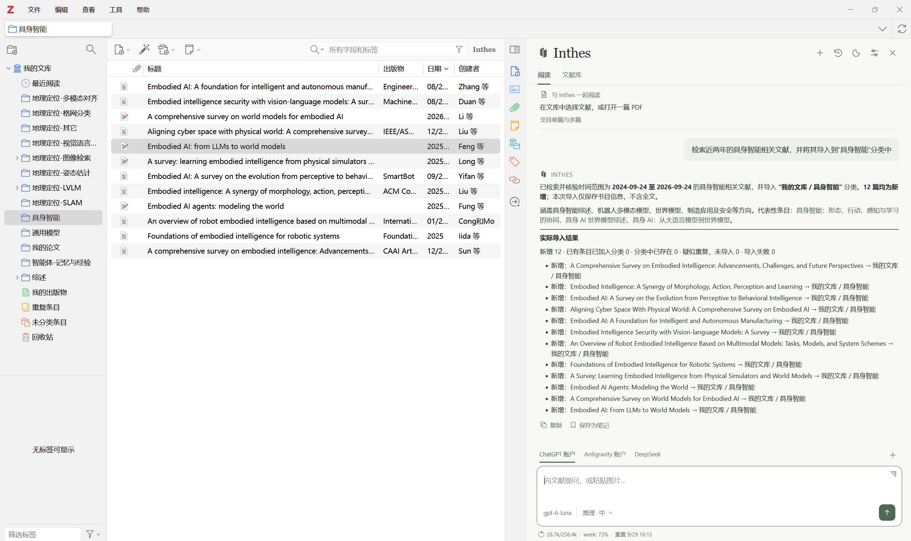
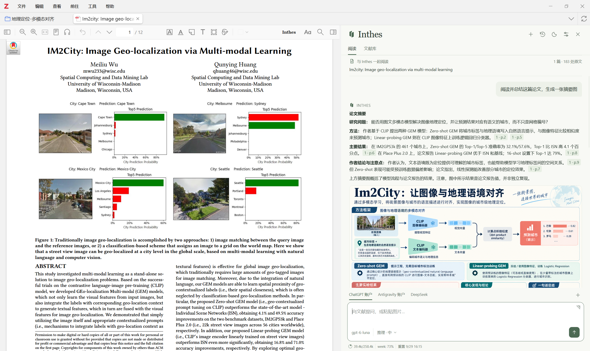

# Inthes

**Where papers meet ideas.**

Inthes 是 Zotero 侧栏中的论文阅读与文献库分析助手。你可以围绕正在阅读的论文提问，也可以选择一个文献分类，比较多篇研究、追踪证据，并将结果整理为 Zotero 笔记。

## 功能

- **支持多种模型服务**：支持连接 ChatGPT、Antigravity 账户，或使用 DeepSeek、OpenRouter、OpenAI、Anthropic、Gemini、Qwen、Kimi、GLM、MiniMax 等 API，支持自定义 API。

  

- **支持单篇/多篇论文阅读**：论文阅读模式支持对当前文献或最多 5 篇选中文献提问、总结和比较。回答中的原文引用可预览，并可跳转到 PDF 对应页。

  

- **支持文献库分析**：支持选中Zotero中的分类或子分类，文献库中支持最多 200 篇文献的问答、逐篇分析和综合比较。

  

  

- **支持MinerU PDF解析**：支持启用 MinerU，对论文中的图片、表格、公式的提取效果更好，对于支持图片输入的多模态模型可以直接读取MinerU提取的图片（或者截图输入），文字模型则只读取文本。不开启则默认使用Zotero本身的解析结果。

- **支持检索并导入论文**：对于支持联网的 API，例如chatgpt账户登录，支持直接在插件中令其检索相关文献并导入到指定分类中。

  

- **支持图片生成显示**：目前仅支持chatgpt账户登录模式，当使用chatgpt登录时，可以直接根据文献生成相应的图片，支持查看或保存到笔记中。

  

- **支持笔记保存**：可以保存单轮问答或完整会话为 Zotero 笔记，支持管理和归档历史会话，支持会话导出 Markdown、JSON、PDF 或 Word 文档。笔记支持回答中的图片、表格和公式。
## 安装

1. 从 [GitHub Releases](https://github.com/zxyl1003/Inthes/releases) 下载最新的 `inthes-<版本>.xpi`。
2. 在 Zotero 10 中打开「工具 → 插件」，从文件安装 XPI。
3. 打开 Inthes 侧栏，在「连接与偏好」中添加模型连接。
4. 选中论文或打开 PDF，即可在「阅读」页提问；需要分析一个分类时，切换到「文献库」页。

详细操作见[使用指南](docs/USER_GUIDE.md)，各连接的设置见[模型连接](docs/CONNECTIONS.md)。

## 来源与数据

Inthes 在回答中标出使用的文献来源。点击本地引用可回到 Zotero 中的 PDF；联网来源以网页链接呈现。研究结论仍应结合原文核对。

对话、设置与解析缓存保存在本机。使用模型时，提问和相关文献内容会发送给你选择的模型服务；启用 MinerU 时，待解析的 PDF 会发送给 MinerU。模型与解析服务的费用由相应服务商收取。

## 文档与项目

- [使用指南](docs/USER_GUIDE.md)
- [模型连接](docs/CONNECTIONS.md)
- [更新记录](CHANGELOG.md)
- [反馈问题](https://github.com/zxyl1003/Inthes/issues)

本项目采用 [CC BY-NC 4.0 许可证](LICENSE)。
